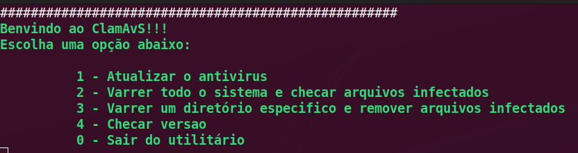

  /$$$$$$  /$$                                             
 /$$__  $$| $$                                             
| $$  \__/| $$  /$$$$$$  /$$$$$$/$$$$   /$$$$$$  /$$    /$$
| $$      | $$ |____  $$| $$_  $$_  $$ |____  $$|  $$  /$$/
| $$      | $$  /$$$$$$$| $$ \ $$ \ $$  /$$$$$$$ \  $$/$$/ 
| $$    $$| $$ /$$__  $$| $$ | $$ | $$ /$$__  $$  \  $$$/  
|  $$$$$$/| $$|  $$$$$$$| $$ | $$ | $$|  $$$$$$$   \  $/   
 \______/ |__/ \_______/|__/ |__/ |__/ \_______/    \_/    
                                                           
                                                           
  
# Script para automatizar o antivirus free clamav.

O antivirus clamav precisa está instalado e configurado.

Caso não esteja instalado siga os passos abaixo.

Distro Debian e derivadas:

$ sudo apt update -y && sudo apt install clamav clamav-deamon

Em seguida vamos atualizar a base de dados do clamav executando o comando abaixo.

$ sudo freshclam

# Instalação em outras distros

# Fedora e distros derivada:

sudo dnf install clamav

# CentOS e distros derivada:

sudo yum install clamav-server clamav-data clamav-update clamav-filesystem clamav clamav-scanner-systemd clamav-devel clamav-lib clamav-server-systemd

# OBS.: Caso ocorra algum erro durante o processo de atualição como estes abaixo.

- ERROR: /var/log/clamav/freshclam.log is locked by another process
- ERROR: Problem with internal logger (UpdateLogFile = /var/log/clamav/freshclam.log).
- ERROR: initialize: libfreshclam init failed.
- ERROR: Initialization error!

# Tente estes comandos abaixo.

1. $ sudo systemctl disable clamav-freshclam.service
2. $ sudo kill -15 $(pgrep freshclam)
3. $ sudo freshclam -v

4. $ sudo freshclam

